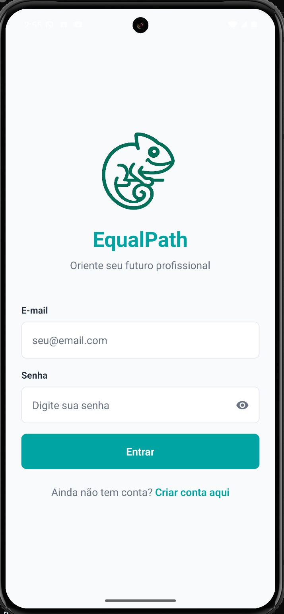

# 💼 EqualPath API – Plataforma Inteligente de Evolução Profissional

## 📝 Descrição do Projeto

A **EqualPath API** é uma aplicação backend desenvolvida em **Java com Spring Boot** para suportar uma plataforma de **orientação, requalificação e evolução profissional**.

O ecossistema EqualPath permite:

- Cadastro de **usuários** com objetivo de carreira e status de perfil;
- Mapeamento de **skills técnicas e comportamentais**;
- Organização de **trilhas de carreira** por nível e objetivo;
- Gestão de **cursos recomendados** por trilha;
- Geração de **recomendações personalizadas** com base no gap de skills do usuário.

Toda a camada de persistência é implementada em **Oracle Database**, garantindo governança de dados, rastreabilidade e aderência a cenários corporativos.

## 📱 Interface do Aplicativo Equalpath
<p align="center">
  
  <br>
  <em>Tela inicial do aplicativo Pedix</em>
</p>


## 🧩 Visão Geral e Arquitetura

A arquitetura da EqualPath foi estruturada com foco em escalabilidade, baixo acoplamento e alta coesão entre as camadas. A organização segue princípios de Clean Architecture e DDD-lite, garantindo clara separação de responsabilidades entre apresentação, regras de negócio, domínio, persistência e segurança.

```mermaid
flowchart TD
    %% Camada de apresentação
    subgraph API_Camada_de_Apresentacao
        A[Controllers REST: Usuario, Skill, Trilha, CursoRecomendado, Recomendacao, Auth, Home]
    end

    %% Camada de regras de negócio
    subgraph Application_Regras_de_Negocio
        B[Services: UsuarioService, SkillService, TrilhaService, CursoRecomendadoService, RecomendacaoService]
        R[Motor de Recomendacao: matching de skills x trilhas]
        G[DTOs Request/Response + Bean Validation]
    end

    %% Camada de domínio
    subgraph Domain_Modelo_de_Dominio
        C[Entidades JPA: Usuario, Skill, Trilha, CursoRecomendado, Area, UsuarioSkill, UsuarioTrilha, TrilhaSkillNecessaria, UsuarioArea]
        H[Enums: ObjetivoCarreira, StatusPerfil, StatusTrilha, CategoriaSkill, TipoSkill, NivelTrilha, PlataformaCurso]
    end

    %% Camada de infraestrutura, segurança e persistência
    subgraph Infrastructure_Persistencia_e_Seguranca
        D[Repositories: Spring Data JPA]
        E[(Banco de Dados Oracle - Schema EqualPath)]
        I[Seguranca JWT: SecurityConfig, JwtTokenService, JwtAuthenticationFilter, AuthUserDetailsService]
    end

    %% Fluxos de dependencia
    A --> B
    A --> I
    B --> R
    R --> C
    B --> C
    B --> D
    D --> E
    C --> H
    B --> G
```




## 🏗️ Camadas e Responsabilidades 

| Camada                          | Pacote                     | Responsabilidade                                                                                                                           |
| ------------------------------- | -------------------------- | ------------------------------------------------------------------------------------------------------------------------------------------ |
| **Apresentação (Controller)**   | `com.equalpath.controller` | Exposição dos **endpoints REST** (Usuário, Skill, Trilha, Curso, Recomendações, Auth). Recebe requisições HTTP e delega para os services.  |
| **Aplicação (Service)**         | `com.equalpath.service`    | Implementa **regras de negócio**, orquestra os domínios (Usuário ↔ Skills ↔ Trilhas) e encapsula a lógica de recomendação.                 |
| **Domínio (Entities / Enums)**  | `com.equalpath.domain`     | Entidades JPA como `Usuario`, `Skill`, `Trilha`, `CursoRecomendado`, `UsuarioSkill`, `TrilhaSkillNecessaria`, além dos enums estratégicos. |
| **DTOs e Contratos**            | `com.equalpath.dto`        | Objetos de transporte (`RequestDTO` e `ResponseDTO`), garantindo desacoplamento entre modelo interno e payload da API.                     |
| **Persistência (Repository)**   | `com.equalpath.repository` | Interfaces Spring Data JPA para comunicação com o **Oracle Database**.                                                                     |
| **Segurança (JWT)**             | `com.equalpath.security`   | Autenticação e autorização via JWT (`SecurityConfig`, `JwtTokenService`, `JwtAuthenticationFilter`, `AuthUserDetailsService`).             |
| **Tratamento de Erros**         | `com.equalpath.exception`  | Handler global (`GlobalExceptionHandler`) e exceções customizadas (`NotFoundException` etc.).                                              |
| **Configurações Cross-Cutting** | `com.equalpath.config`     | Configurações de CORS, OpenAPI/Swagger e demais cross-cutting concerns.                                                                    |


## 🛠 Tecnologias Utilizadas

| Categoria      | Tecnologia               | Uso Principal                                             |
| -------------- | ------------------------ | --------------------------------------------------------- |
| Linguagem      | ☕ **Java 17+**           | Desenvolvimento backend.                                  |
| Framework      | 🌱 **Spring Boot 3.x**   | Core da aplicação, injeção de dependência e stack web.    |
| Web            | 🌐 Spring Web            | Exposição de APIs RESTful.                                |
| Persistência   | 🗄️ Spring Data JPA      | ORM e comunicação com o banco.                            |
| Banco de Dados | 💾 Oracle Database       | Armazenamento relacional (modelo em 3FN).                 |
| Segurança      | 🔐 JWT + Spring Security | Autenticação e autorização baseada em token.              |
| Utilitário     | ✨ Lombok                 | Redução de boilerplate (getters, setters, builders etc.). |
| Documentação   | 📖 Springdoc OpenAPI     | Geração automática do Swagger UI.                         |
| Build          | 🛠️ Maven                | Gerenciamento de dependências e ciclo de vida do projeto. |
| Testes         | 📬 Postman               | Testes de integração e validação dos endpoints.           |

## 📂 Estrutura de Pastas (macro)
```
equalpath-api/
│
├── .idea/                     # Configurações do IntelliJ (ambiente de desenvolvimento)
├── .mvn/                      # Infra Maven Wrapper
│
├── docs/                      # Artefatos de documentação e insumos da solução
│   ├── diagramas/             # Diagramas de arquitetura, domínio e banco
│   │   ├── DER - EqualPath.png
│   │   ├── Diagrama UML.png
│   │   └── MER - EqualPath.png
│   │
│   ├── imagens/               # Screenshots e evidências relevantes
│   │   └── tela-inicial-app.png.jpeg
│   │
│   └── testes/                # Insumos de QA e automação de testes
│       └── Equalpath API.postman_collection.json
│
├── src/
│   └── main/
│       ├── java/com/equalpath/
│       │
│       │── config/            # Configurações cross-cutting da aplicação
│       │   ├── CorsConfig.java
│       │   └── OpenApiConfig.java
│       │
│       │── controller/        # Camada de exposição REST (entrypoints da API)
│       │   ├── AuthController.java
│       │   ├── CursoRecomendadoController.java
│       │   ├── HomeController.java
│       │   ├── RecomendacaoController.java
│       │   ├── SkillController.java
│       │   ├── TrilhaController.java
│       │   └── UsuarioController.java
│       │
│       │── domain/            # Modelo de domínio e entidades JPA
│       │   ├── enums/
│       │   │   ├── CategoriaSkill.java
│       │   │   ├── NivelTrilha.java
│       │   │   ├── ObjetivoCarreira.java
│       │   │   ├── PlataformaCurso.java
│       │   │   ├── StatusPerfil.java
│       │   │   ├── StatusTrilha.java
│       │   │   └── TipoSkill.java
│       │   │
│       │   ├── Area.java
│       │   ├── CursoRecomendado.java
│       │   ├── Skill.java
│       │   ├── Trilha.java
│       │   ├── TrilhaSkillNecessaria.java
│       │   ├── Usuario.java
│       │   ├── UsuarioArea.java
│       │   ├── UsuarioSkill.java
│       │   └── UsuarioTrilha.java
│       │
│       │── dto/               # DTOs de entrada/saída (Request/Response)
│       │   ├── AuthRequestDTO.java
│       │   ├── AuthResponseDTO.java
│       │   ├── CursoRecomendadoRequestDTO.java
│       │   ├── CursoRecomendadoResponseDTO.java
│       │   ├── MensagemResponseDTO.java
│       │   ├── RecomendacaoResponseDTO.java
│       │   ├── SkillRequestDTO.java
│       │   ├── SkillResponseDTO.java
│       │   ├── TrilhaRequestDTO.java
│       │   ├── TrilhaResponseDTO.java
│       │   ├── UsuarioRequestDTO.java
│       │   └── UsuarioResponseDTO.java
│       │
│       │── exception/         # Governança de erros e padronização de respostas
│       │   ├── GlobalExceptionHandler.java
│       │   └── NotFoundException.java
│       │
│       │── repository/        # Interfaces de persistência (Spring Data JPA)
│       │   ├── CursoRecomendadoRepository.java
│       │   ├── SkillRepository.java
│       │   ├── TrilhaRepository.java
│       │   ├── UsuarioAreaRepository.java
│       │   ├── UsuarioRepository.java
│       │   ├── UsuarioSkillRepository.java
│       │   └── UsuarioTrilhaRepository.java
│       │
│       │── security/          # Stack de autenticação e geração de tokens
│       │   ├── AuthUserDetailsService.java
│       │   ├── JwtAuthenticationFilter.java
│       │   ├── JwtTokenService.java
│       │   └── SecurityConfig.java
│       │
│       │── service/           # Regras de negócio e orquestração das operações
│       │   ├── CursoRecomendadoService.java
│       │   ├── RecomendacaoService.java
│       │   ├── SkillService.java
│       │   ├── TrilhaService.java
│       │   └── UsuarioService.java
│       │
│       │── EqualpathApiApplication.java   # Entry point da aplicação
│       │
│       └── resources/         # Arquivos de config e assets internos
│           ├── static/        
│           ├── templates/     
│           ├── application.properties     # Configurações da aplicação
│           
│
├── test/                      
│
├── target/                    
├── .gitattributes
├── .gitignore
├── HELP.md
├── mvnw
├── mvnw.cmd
├── pom.xml
└── README.md
```

## 🧩 Funcionalidades

👤 Gestão de usuários com objetivo de carreira e status do perfil;

🧠 Cadastro e categorização de skills técnicas/comportamentais;

🛣️ Trilhas de desenvolvimento por nível (Júnior, Pleno, Sênior) e objetivo de carreira;

📚 Cursos recomendados por trilha, com plataforma e carga horária;

🧮 Motor de recomendação que calcula aderência entre perfil do usuário e trilhas;

🔐 Autenticação JWT para garantir segurança de acesso;

📖 Documentação Swagger/OpenAPI para consumo facilitado da API;

🗃️ Persistência em Oracle Database com modelagem normalizada.


# 🚀 Como Rodar a Aplicação
1. Clonar o repositório
```
   git clone https://github.com/alanerochaa/equalpath-api.git
```
2. Build e execução com Maven 
A API sobe em:
```
http://localhost:8080/swagger-ui/index.html
```

## 🌐 Endpoints da API 

### 🖥️ Ambiente Local

| Finalidade      | URL                                                                                        | Descrição                                         |
| --------------- | ------------------------------------------------------------------------------------------ | ------------------------------------------------- |
| 🏠 Home (Root)  | [http://localhost:8080/](http://localhost:8080/)                                           | Verifica a disponibilidade da API local.          |
| 📊 JSON (/home) | [http://localhost:8080/home](http://localhost:8080/home)                                   | Endpoint com status da aplicação + links HATEOAS. |
| 📖 Swagger UI   | [http://localhost:8080/swagger-ui/index.html](http://localhost:8080/swagger-ui/index.html) | Playground interativo dos endpoints REST.         |
| 🔐 Auth (Login) | [http://localhost:8080/api/auth/login](http://localhost:8080/api/auth/login)               | Autenticação com geração de token JWT.            |


### ☁️ Ambiente de Produção (Render)
| Finalidade      | URL                                                                                                                  | Descrição                                                      |
| --------------- | -------------------------------------------------------------------------------------------------------------------- | -------------------------------------------------------------- |
| 🏠 Home (Root)  | [https://equalpath-api.onrender.com/](https://equalpath-api.onrender.com/)                                           | Verifica se a API está operacional no ambiente produtivo.      |
| 📊 JSON (/home) | [https://equalpath-api.onrender.com/home](https://equalpath-api.onrender.com/home)                                   | Endpoint de status + HATEOAS rodando em produção.              |
| 📖 Swagger UI   | [https://equalpath-api.onrender.com/swagger-ui/index.html](https://equalpath-api.onrender.com/swagger-ui/index.html) | Interface completa para teste dos endpoints em ambiente cloud. |
| 🔐 Auth (Login) | [https://equalpath-api.onrender.com/api/auth/login](https://equalpath-api.onrender.com/api/auth/login)               | Autenticação e emissão do JWT em produção.                     |


## 🧭 Visão Geral dos Endpoints da Plataforma EqualPath

### 🔐 Autenticação – Fluxo JWT da EqualPath
| Recurso                  | Descrição                                                                  | Método / Endpoint            | 
| ------------------------ | -------------------------------------------------------------------------- | ---------------------------- |  
| **Autenticação (Login)** | Geração do token JWT para acesso aos recursos protegidos da EqualPath API. | **POST – `/api/auth/login`** | 

✔ ️ Autenticação – Exemplo (Login)
```
{
"username": "admin",
"password": "codegirls"
}
```

### 👤 Usuário

| Método   | Endpoint             | Descrição                             |
| -------- | -------------------- | ------------------------------------- |
| `POST`   | `/api/usuarios`      | Criar novo usuário.                   |
| `GET`    | `/api/usuarios`      | Listar usuários por status de perfil. |
| `GET`    | `/api/usuarios/{id}` | Buscar usuário por ID.                |
| `PUT`    | `/api/usuarios/{id}` | Atualizar dados cadastrais.           |
| `DELETE` | `/api/usuarios/{id}` | Excluir usuário.                      |

✔️ Usuário – Exemplo (Criar novo usuário)
```
{
  "nome": "Julia",
  "sobrenome": "Silva",
  "email": "julia.silva@example.com",
  "telefone": "11999998888",
  "estado": "SP",
  "objetivoCarreira": "DESENVOLVEDORA_BACKEND",
  "statusPerfil": "ATIVO"
}
```

### Resposta:
```
{
  "id": 13,
  "nome": "Julia",
  "sobrenome": "Silva",
  "email": "julia.silva@example.com",
  "telefone": "11999998888",
  "estado": "SP",
  "dtCadastro": "2025-11-22",
  "objetivoCarreira": "DESENVOLVEDORA_BACKEND",
  "statusPerfil": "ATIVO",
  "_links": {
    "self": {
      "href": "http://localhost:8080/api/usuarios/13"
    },
    "usuarios": {
      "href": "http://localhost:8080/api/usuarios/status{?statusPerfil}",
      "templated": true
    }
  }
}
```


### 🧠 Skills
| Método   | Endpoint           | Descrição                  |
| -------- | ------------------ | -------------------------- |
| `POST`   | `/api/skills`      | Criar nova skill.          |
| `GET`    | `/api/skills`      | Listar skills cadastradas. |
| `GET`    | `/api/skills/{id}` | Consultar skill por ID.    |
| `PUT`    | `/api/skills/{id}` | Atualizar skill existente. |
| `DELETE` | `/api/skills/{id}` | Excluir skill.             |

✔️ Skill – Exemplo (Criar skill)
```
{
  "nome": "Java Avançado",
  "descricao": "Domínio de recursos avançados da linguagem, incluindo Streams, Optional, Generics e boas práticas de arquitetura.",
  "nivel": "AVANCADO",
  "categoria": "BACKEND",
  "tipo": "TECNICA"
}
```
### Resposta:
```
{
  "id": 11,
  "nome": "Java Avançado",
  "descricao": "Domínio de recursos avançados da linguagem, incluindo Streams, Optional, Generics e boas práticas de arquitetura.",
  "nivel": "AVANCADO",
  "categoria": "BACKEND",
  "tipo": "TECNICA",
  "ultimoAcesso": "2025-11-22",
  "_links": {
    "self": {
      "href": "http://localhost:8080/api/skills/11"
    },
    "skills": {
      "href": "http://localhost:8080/api/skills"
    }
  }
}
```

### 🛣️ Trilhas
| Método   | Endpoint            | Descrição                      |
| -------- | ------------------- | ------------------------------ |
| `POST`   | `/api/trilhas`      | Criar nova trilha de carreira. |
| `GET`    | `/api/trilhas`      | Listar trilhas cadastradas.    |
| `GET`    | `/api/trilhas/{id}` | Consultar trilha por ID.       |
| `PUT`    | `/api/trilhas/{id}` | Atualizar trilha existente.    |
| `DELETE` | `/api/trilhas/{id}` | Excluir trilha.                |

✔️ Trilha – Exemplo (Criar trilha)
```
{
  "nome": "Backend Java",
  "descricao": "Trilha focada em desenvolvimento backend com Spring Boot.",
  "nivel": "INTERMEDIARIO",
  "objetivo": "DESENVOLVEDORA_BACKEND",
  "status": "ATIVO"
}
```

### Resposta:
```
{
  "id": 11,
  "nome": "Backend Java",
  "descricao": "Trilha focada em desenvolvimento backend com Spring Boot.",
  "nivel": "INTERMEDIARIO",
  "objetivo": "DESENVOLVEDORA_BACKEND",
  "status": "ATIVO",
  "dtCriacao": "2025-11-22",
  "_links": {
    "self": {
      "href": "http://localhost:8080/api/trilhas/11"
    },
    "trilhas": {
      "href": "http://localhost:8080/api/trilhas{?status}",
      "templated": true
    }
  }
}
```

### 📚 Cursos Recomendados
| Método   | Endpoint           | Descrição                                |
| -------- | ------------------ | ---------------------------------------- |
| `POST`   | `/api/cursos`      | Criar curso recomendado para uma trilha. |
| `GET`    | `/api/cursos`      | Listar cursos recomendados.              |
| `GET`    | `/api/cursos/{id}` | Buscar curso recomendado por ID.         |
| `PUT`    | `/api/cursos/{id}` | Atualizar curso recomendado.             |
| `DELETE` | `/api/cursos/{id}` | Excluir curso recomendado.               |

✔️ Curso – Exemplo (Criar curso recomendado)
```
{
  "nome": "Formação Spring Boot",
  "url": "https://alura.com.br/spring",
  "idTrilha": 1,
  "plataforma": "ALURA",
  "duracaoHoras": 40
}
```

### Resposta:
```
{
  "id": 11,
  "nome": "Formação Spring Boot",
  "url": "https://alura.com.br/spring",
  "idTrilha": 1,
  "nomeTrilha": "Backend Java Jr",
  "plataforma": "ALURA",
  "duracaoHoras": 40,
  "_links": {
    "self": {
      "href": "http://localhost:8080/api/cursos/11"
    },
    "cursos_da_trilha": {
      "href": "http://localhost:8080/api/cursos?idTrilha=1{&plataforma}",
      "templated": true
    }
  }
}
```
### 🧭 Recomendações
| Método | Endpoint                                 | Descrição                                                               |
| ------ | ---------------------------------------- | ----------------------------------------------------------------------- |
| `GET`  | `/api/recomendacoes/usuario/{idUsuario}` | Recomendar trilhas com base nas skills do usuário e score de aderência. |
✔️ Recomendação – Exemplo (Consumir endpoint)
```
GET /api/recomendacoes/usuario/1

```
### Resposta:
```
{
  "_embedded": {
    "recomendacaoResponseDTOList": [
      {
        "idTrilha": 1,
        "nomeTrilha": "Backend Java Jr",
        "percentualAderencia": 100,
        "skillsUsuarioPossui": [
          "Java",
          "Spring Boot"
        ],
        "skillsNecessarias": [
          "Spring Boot",
          "Java"
        ]
      },
      {
        "idTrilha": 2,
        "nomeTrilha": "Data Analytics",
        "percentualAderencia": 0,
        "skillsUsuarioPossui": [],
        "skillsNecessarias": [
          "SQL",
          "Power BI"
        ]
      },
      {
        "idTrilha": 3,
        "nomeTrilha": "Frontend React",
        "percentualAderencia": 0,
        "skillsUsuarioPossui": [],
        "skillsNecessarias": [
          "React"
        ]
      },
      {
        "idTrilha": 4,
        "nomeTrilha": "DevOps Essentials",
        "percentualAderencia": 0,
        "skillsUsuarioPossui": [],
        "skillsNecessarias": [
          "Python",
          "PL/SQL"
        ]
      },
      {
        "idTrilha": 5,
        "nomeTrilha": "Mobile Kotlin",
        "percentualAderencia": 0,
        "skillsUsuarioPossui": [],
        "skillsNecessarias": [
          "C#"
        ]
      },
      {
        "idTrilha": 7,
        "nomeTrilha": "Cloud Practitioner",
        "percentualAderencia": 0,
        "skillsUsuarioPossui": [],
        "skillsNecessarias": [
          "Python"
        ]
      },
      {
        "idTrilha": 9,
        "nomeTrilha": "QA Automation",
        "percentualAderencia": 0,
        "skillsUsuarioPossui": [],
        "skillsNecessarias": [
          "SQL"
        ]
      }
    ]
  },
  "_links": {
    "self": {
      "href": "http://localhost:8080/api/recomendacoes/usuario/1"
    },
    "usuario": {
      "href": "http://localhost:8080/api/usuarios/1"
    },
    "trilhas": {
      "href": "http://localhost:8080/api/trilhas{?status}",
      "templated": true
    },
    "cursos": {
      "href": "http://localhost:8080/api/cursos?idTrilha={idTrilha}{&plataforma}",
      "templated": true
    }
  }
}
```

## 🗄️ Scripts SQL e Modelagem de Banco
A arquitetura de dados da EqualPath foi estruturada em 3ª Forma Normal (3FN), garantindo governança, integridade referencial e aderência aos padrões corporativos de modelagem.

A seguir, a visão executiva dos componentes do banco:

| Componente                      | Descrição                                                                              |
| ------------------------------- | -------------------------------------------------------------------------------------- |
| **Entidades principais**        | `USUARIO`, `SKILL`, `TRILHA`, `CURSO_RECOMENDADO`, `AREA`                              |
| **Entidades de relacionamento** | `USUARIO_SKILL`, `TRILHA_SKILL_NECESSARIA`, `USUARIO_TRILHA`, `USUARIO_AREA`           |
| **Chaves primárias**            | Implementadas via *sequences* dedicadas (ex.: `SEQ_USUARIO`, `SEQ_SKILL`)              |
| **Chaves estrangeiras**         | Relacionamentos normalizados garantindo integridade referencial                        |
| **Sequences**                   | Utilizadas para geração incremental de IDs                                             |
| **Procedures de carga**         | Procedures de insert massivo e governança de dados utilizadas para a população inicial |
| **Padrão**                      | Modelagem íntegra, 3FN, alinhada ao DER/MER versionado em *docs/diagramas*             |

### 📂 Scripts SQL (versão final e disponível no repositório)

Os scripts oficiais utilizados na construção e carga do banco estão versionados no projeto:

| Arquivo                                                                          | Descrição                                                                  |
| -------------------------------------------------------------------------------- | -------------------------------------------------------------------------- |
| [`docs/scripts/equalpath_ddl.sql`](docs/scripts/equalpath_ddl.sql)               | DDL completo: criação de tabelas, sequences, constraints e relacionamentos |
| [`docs/scripts/equalpath_procedures.sql`](docs/scripts/equalpath_procedures.sql) | Procedures de insert, regras de carga e rotinas auxiliares                 |


📌 Ambos os arquivos estão presentes dentro do código-fonte e foram utilizados na configuração do ambiente Oracle.


## 📊 Diagramas

A solução EqualPath conta com um conjunto de diagramas estruturados para dar suporte tanto à visão técnica quanto à narrativa de negócio.

### 🔹 DER – Diagrama Entidade-Relacionamento


### 🔹 MER – Modelo Entidade-Relacionamento (Lógico/Físico)


### 🔹 Diagrama UML – Modelo de Classes da API


Esses artefatos subsidiam a compreensão da arquitetura, dos relacionamentos de domínio e do fluxo operacional sustentado pela API.


## 🧪 Testes no Postman

A coleção de requisições utilizada para validação da EqualPath API está disponível em:

👉 [Equalpath API.postman_collection.json](docs/testes/Equalpath%20API.postman_collection.json)

Basta importar o arquivo no Postman para executar todos os cenários de teste (CRUD, autenticação JWT e validações de erro).


## 🎬 Vídeos de Apresentação
 ### Pitch  – EqualPath (Visão do Projeto)

Este vídeo apresenta, o propósito estratégico da EqualPath, cobrindo o contexto do problema, proposta de valor, , arquitetura macro e visão de impacto social.

* 📺 Assista aqui:
*  https://www.youtube.com/watch?v=Rf0naht3hk4

### Demonstração Técnica – EqualPath API (Swagger + Banco + Testes e app)
Esta demonstração apresenta a execução dos principais endpoints no Swagger, validações, cenários de CRUD e evidências de persistência no PostgreSQL e, ao final, uma visualização rápida do aplicativo.

* 📺 Assista aqui:
* 

## 👩‍💻 Integrantes e Responsabilidades

| Nome Completo | RM | Função no Projeto | GitHub |
|----------------|----|------------------|--------|
| **Alane Rocha da Silva** | RM561052 | Desenvolvimento da API Java (Spring Boot), integração com banco Oracle e documentação | [@alanerochaa](https://github.com/alanerochaa) |
| **Anna Beatriz Bonfim** | RM559561 | Desenvolvimento do aplicativo mobile (React Native) e integração com IoT | [@annabonfim](https://github.com/annabonfim) |
| **Maria Eduarda Araujo Penas** | RM560944 | Desenvolvimento da API C# e DevOps  | [@DudaAraujo14](https://github.com/DudaAraujo14) |


<p align="center">
  Desenvolvido com 💜 pela equipe <strong>CodeGirls</strong> — FIAP 2025.
</p>